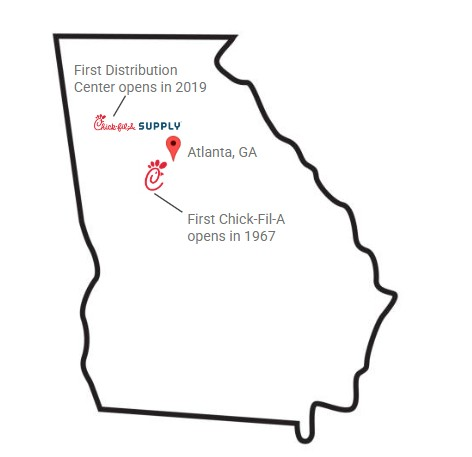
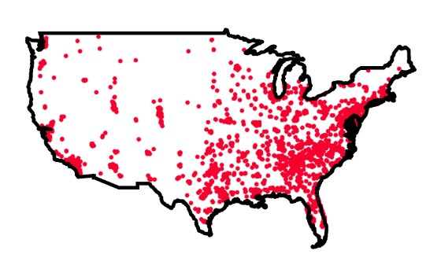
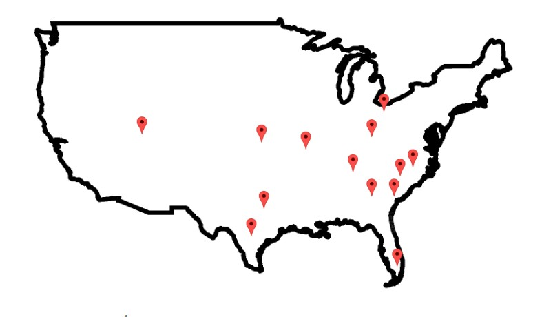
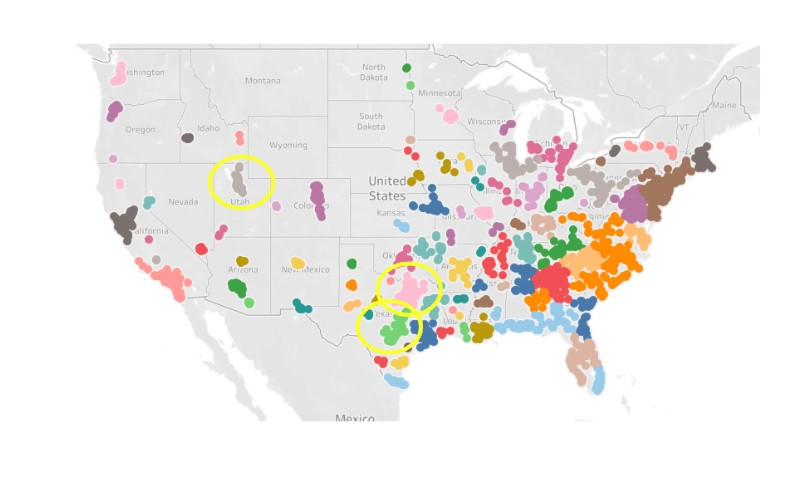
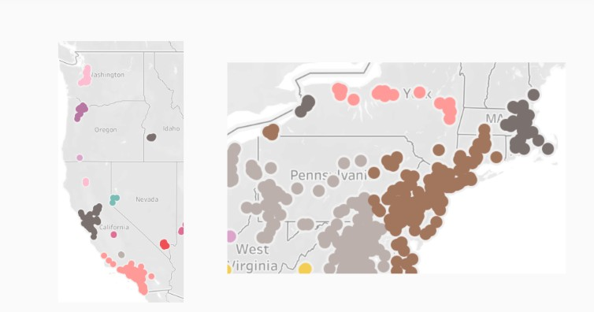
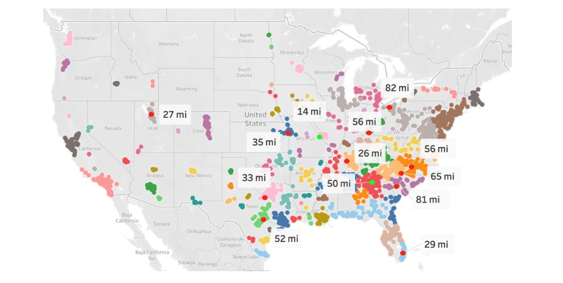

# Chick-fil-A Supply: Network Theory & Distribution Center Analysis  
University of Notre Dame — MSBA Program  
**Course**: Network Theory & Analysis  
**Date**: April 29, 2025  

This project applies network theory to analyze the rapid expansion of **Chick-fil-A Supply**, a logistics-focused subsidiary of Chick-fil-A. Using clustering algorithms and centrality metrics, we evaluated whether the company’s distribution center (DC) placements align with store density and geographic efficiency. By modeling store relationships as a network, we uncovered structural patterns in Chick-fil-A’s supply chain and explored opportunities for strategic expansion. This analysis was completed as part of the **MSBA Network Theory & Analysis** course at the University of Notre Dame.

---

## Team

- **Alex Heck** – [@aheck3](https://github.com/aheck3)  
- **Cooper Foster** – [@coopfos](https://github.com/coopfos)  
- **Grace Robinson**

---

## Objective

1. Can clustering analysis explain where Chick-fil-A has placed their existing distribution centers?  
2. Where should Chick-fil-A strategically place new centers based on store geography?  

---

## Background

Chick-fil-A Supply launched in **2019** to vertically integrate and streamline the brand’s growing logistics needs. The subsidiary currently operates **13 confirmed DCs** to support over **3,200+ store locations** nationwide.

---

## Network Structure

- **Nodes**: All U.S. Chick-fil-A restaurant locations (scraped from Chick-fil-A’s website)  
- **Edges**: Pairwise geographic distances between stores (calculated using the `geosphere` package in R)

---

## Methodology

1. **Scraped Chick-fil-A store location data** using Python
2. **Calculated pairwise geographic distances** between stores using the `geosphere` package in R  
3. Removed duplicate vertices and cleaned store/location data  
4. Constructed an **undirected graph** where nodes are stores and edges are distances  
5. Applied the **Louvain clustering algorithm** to detect store communities  
6. Tested distance-based edge cutoffs (50km–500km) to find optimal cluster structure  
7. Calculated **closeness centrality** to assess how well-positioned each DC is within its community

---

## Clustering: Initial Cutoffs

We explored clustering scenarios using radius thresholds of 200km, 300km, and 500km. Higher thresholds led to fewer clusters and lower modularity.

---

## Optimal Cutoff Selection

We ran Louvain clustering across cutoffs from 50–500 km to compare actual DC coverage to cluster size. The **75 km** cutoff yielded the lowest error and highest modularity (0.91), identifying 98 meaningful communities.

---

## Identifying Expansion Opportunities

Clusters showed **gaps** in the West Coast and Northeast regions. We recommend new DCs in high-density zones like **Los Angeles**, **Bay Area**, and **New York City**.

---

## DC Centrality Analysis

Using **closeness centrality**, we evaluated how centrally positioned each DC is within its local community. Several DCs ranked well, while others had room for optimization.

---

## Key Takeaways

- Distance-based clustering explains many current DC placements  
- High-density regions without nearby DCs signal strong opportunities for expansion  
- Simple network models can offer valuable insights for complex logistics systems  

---

## Files Included

- `chickfila-supply-network-analysis-code.Rmd` – Full R Markdown file with all modeling code  
- `cfa_edges.rda` / `cfa_nodes.rda` – Raw network input data  
- `cfa_w_clusters.csv` – Node list with cluster assignments  
- `dc_ref.csv` – DC-to-cluster lookup table for evaluation  
- `uszips.csv`, `zip_list.csv` – Zip code to lat/lng mapping for distance calculations  
- `images/` – Visuals used throughout this README  
- 📄 [Presentation Slides (PDF)](chickfila-supply-presentation.pdf)

---

## Visual Summary

| Store Network | Supply Chain Footprint | Expansion Zones |
|---------------|------------------------|-----------------|
|  |  |  |

---

## Acknowledgments

Thanks to my teammates:  
- **Grace Robinson** – MSBA  
- **Cooper Foster** – [@coopfos](https://github.com/coopfos)

And thank you to **Professor Margaret Traeger** for an engaging and practical exploration of network theory in business analytics.

---
